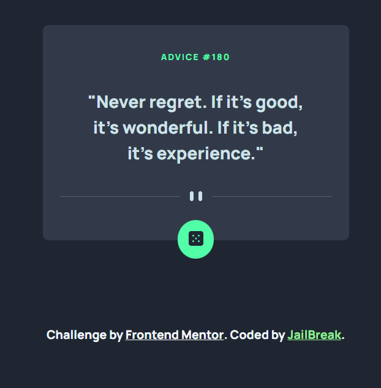

# Frontend Mentor - Advice generator app solution

This is a solution to the [Advice generator app challenge on Frontend Mentor](https://www.frontendmentor.io/challenges/advice-generator-app-QdUG-13db). Frontend Mentor challenges help you improve your coding skills by building realistic projects.

## Table of contents

- [Overview](#overview)
  - [The challenge](#the-challenge)
  - [Screenshot](#screenshot)
  - [Links](#links)
- [My process](#my-process)
  - [Built with](#built-with)
  - [What I learned](#what-i-learned)
  - [Continued development](#continued-development)
  - [Useful resources](#useful-resources)
- [Author](#author)
- [Acknowledgments](#acknowledgments)


## Overview


### The challenge

Users should be able to:

- View the optimal layout for the app depending on their device's screen size
- See hover states for all interactive elements on the page
- Generate a new piece of advice by clicking the dice icon

### Screenshot


### Links

- Solution URL: [Add solution URL here](https://your-solution-url.com)
- Live Site URL: [Add live site URL here](https://genix-advice-generator.netlify.app/)

## My process

### Built with

- Semantic HTML5 markup
- CSS custom properties
- Flexbox
- Mobile-first workflow
- Fetch Api Method with Javascript (resulting to a Javascript Promisr Object) 


### What I learned

I learnt that even without using the fetch API, i could make use of the async keyword with a function, using the await keyword as well for asynchronous operations in JavaScript, but this wasn't what i used. I learnt how to apply all the Asychronous methods of writing JavaScript aside the Fetch method (with .then and .catch), I used the Promise function and async functions. I learnt that for Asynchronous operations, you can use either of the two, because they both return promise objects, that either have success of failure state, depending on how the request of the user goes. I also learnt that when you make a request, it can be handled properly with the Promise Object, on whether it'll be successful, and what it should do when it is successful, and whether it'll not be successful and what it should do when it is not successful, and i hope to learn more as I make more use of the async function, fetch method and Promise Keyword in Asynchronous operations.

An example of Async function and fetch API method of my code: 
```js
async function getapi(url) {
    let advice = await fetch(url);

    let data = await advice.json();
    console.log(data);

    // To put this as our text.

    // To check if it has loaded.
}

// CALLING THE ASYNC FUNCTION TO FETCH THE DATA WITH THE URL AS THE PARAMETER (argument).
getapi('https://api.adviceslip.com/advice');


// WHAT I USED PUTTING IT INTO A FUNCTION THAT ACCEPTS A URL AS A PARAMETER (argument), from the user.
let call_fetch = () => {
  fetch(url)
    .then((data) => data.json())
    .then((advice) => {
      console.log("USER FETCHED");
      advice_id.innerHTML = advice.slip.id;
      advice_quote.innerHTML = advice.slip.advice;
    })
    .catch(() => {
      advice_id.innerHTML = 'ERROR 404'
      advice_quote.innerHTML = 'FAILED TO FETCH, CONNECTION TIMEOUT'
    });
}

// CALLING THE FETCH AS A FUNCTION
call_fetch()

```

### Continued development

I want to learn more as I make more use of the async function, fetch method and Promise Keyword in Asynchronous operations.
I also don't want to make use of the old way of using Callbacks for Asynchronous operations in Javascript again. 
I look forward to exploring other ways in which Asynchronous JavaScript methods can be useful, and in the way that they can be used in those situations.

### Useful resources

- [Colt Steele's Course on Web Development on Udemy](https://www.udemy.com/course/the-web-developer-bootcamp/learn/lecture/22051340) - This helped me for Web Dev on Promises. I really liked this Promises concepts and will use it going forward more projects.
- [Kyle's YouTube Channel for Amazing Web Dev Concepts and Videos](https://www.youtube.com/watch?v=cuEtnrL9-H0) - This is an amazing article which helped me finally understand Asynchronous Operations using Fetch API. I'd recommend it to anyone still learning this concept.

## Author

- Frontend Mentor - [@JAILBREAK](https://www.frontendmentor.io/profile/JAILBREAK-101)
- Twitter - [@Oluwagbemiga](https://www.twitter.com/GenixTech1)
- Github - [@JAILBREAK-101](https://github.com/JAILBREAK-101)


## Acknowledgments

- I appreciate Colt Steele (A Udemy Instructor), and YouTuber for his amazing course on Full-Stack Web Development, for teaching me amazing and important concepts that I need to know and understand in order for me to become a Full-Stack Web Developer. It was from his course I got the knowledge of what JavaScript Promises really are, and he taught it in such an amazing way. 

- I also give credit to Kyle from Web Dev Simplified for his video on YouTube about the JavaScript Fetch API method and its use cases (When to use it, and when not to). He is an amazing YouTuber who teaches great concepts on Web Development, and Computer Programming in general. I totally recommend him unto anyone who wants to learn anything Web and also those who want to understand some programming concepts.
His YouTube Link: https://www.youtube.com/watch?v=cuEtnrL9-H0